### Apa itu prometheus dan grafana ?

Prometheus adalah sistem untuk monitoring dan time-series database. prometheus akan mengumpulkan data penggunaan resource server ataupun log aplikasi yang nantinya akan disimpan secara time-series (berurutan sesuai waktu pengambilan datanya). data ini nantinya akan bisa ditampilkan dalam dashboard monitoring penggunaan resource server. cara kerja prometheus adalah prometheus akan melakukan penarikan data pada tiap-tiap server yang sudah dikonfigurasi sebelumnya secara periodik. agar prometheus bisa mengambil data penggunaan resources dan log dibutuhkan yang namanya `exporter` yaitu sebuah software yang akan metric penggunaan server. exporter ini ada banyak jenisnya, tapi yang umum dipakai adalah
node exporter untuk mengumpulkan data penggunaan memory, cpu usage, io dan lain-lain. jika membutuhkan data terkait aplikasi seperti postgres database, php-fpm dan sebagainya bisa dilihat di https://prometheus.io/docs/instrumenting/exporters/https://prometheus.io/docs/instrumentin.

sedangkan grafana adalah platform untuk membuat dashboard berdasarkan data yang ada pada prometheus.

### Arsitektur prometheus

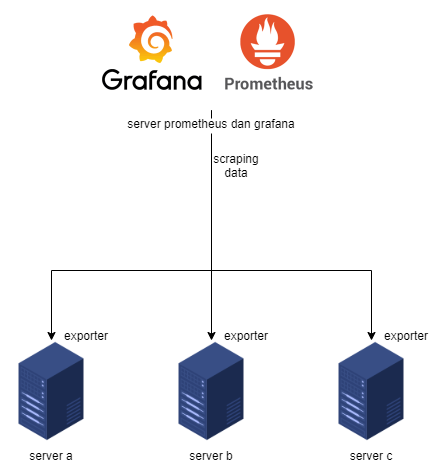  
disini prometheus akan berperan aktif dalam mengambil data ke server-server yang ada. lalu grafana akan menampilkan datanya dalam bentuk grafik

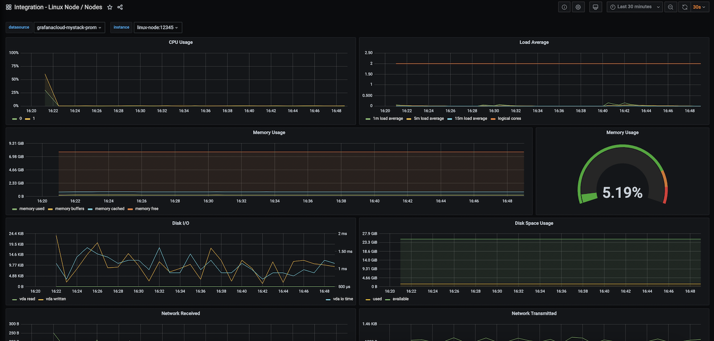

### Instalasi pada centos 7

disini kita akan menggunakan centos 7 untuk melakukan instalasi prometheus dan grafana.

#### Instalasi Prometheus

1. download prometheus versi terbaru, disini kita akan menggunakan versi 2.31.1  
   `wget https://github.com/prometheus/prometheus/releases/download/v2.31.1/prometheus-2.31.1.linux-amd64.tar.gz`
2. extract file hasil download  
   `tar xvf prometheus-2.31.1.linux-amd64.tar.gz`
3. copy folder `prometheus-2.31.1.linux-amd64/prometheus` & `prometheus-2.31.1.linux-amd64/promtool` ke `/usr/local/bin`

```bash
cp prometheus-2.31.1.linux-amd64/prometheus /usr/local/bin/
cp prometheus-2.31.1.linux-amd64/promtool /usr/local/bin/
```

4. copy folder `prometheus-2.31.1.linux-amd64/consoles` & `prometheus-2.31.1.linux-amd64/console_libraries` ke `/etc/prometheus`

```bash
mkdir /etc/prometheus/
cp -r prometheus-2.31.1.linux-amd64/consoles/ /etc/prometheus/
cp -r prometheus-2.31.1.linux-amd64/console_libraries/ /etc/prometheus/
```

5. buat file konfigurasi prometheus

   ```bash
   touch /etc/prometheus/prometheus.yml
   ```

   isi file konfigurasinya adalah

   ```yaml
   global:
     scrape_interval: 15s
   ```

6. buat user untuk menjalankan prometheus.  
   `useradd --no-create-home --shell /bin/false prometheus`
7. ganti kepemilikan folder-folder yang tadi ke user `prometheus` dengan perintah

```bash
chown prometheus:prometheus /usr/local/bin/prometheus
chown prometheus:prometheus /usr/local/bin/promtool
chown -R prometheus:prometheus /var/lib/prometheus
chown -R prometheus:prometheus /etc/prometheus
```

8. setelah file-file yang dibutuhkan sudah diinstall kita akan coba menjalankan prometheus dengan perintah

   ```bash
   su - prometheus
   /usr/local/bin/prometheus \
      --config.file /etc/prometheus/prometheus.yml \
      --storage.tsdb.path /var/lib/prometheus \
      --web.console.templates=/etc/prometheus/consoles \
      --web.console.libraries=/etc/prometheus/console_libraries
   ```

   jika sukses akan muncul

   ```
   ts=2021-11-24T06:24:48.134Z caller=main.go:406 level=info msg="No time or size retention was set so using the default time retention" duration=15d
   ts=2021-11-24T06:24:48.134Z caller=main.go:444 level=info msg="Starting Prometheus" version="(version=2.31.1, branch=HEAD, revision=411021ada9ab41095923b8d2df9365b632fd40c3)"
   ts=2021-11-24T06:24:48.134Z caller=main.go:449 level=info build_context="(go=go1.17.3, user=root@9419c9c2d4e0, date=20211105-20:35:02)"
   ts=2021-11-24T06:24:48.134Z caller=main.go:450 level=info host_details="(Linux 3.10.0-1127.el7.x86_64 #1 SMP Tue Mar 31 23:36:51 UTC 2020 x86_64 prometheus (none))"
   ts=2021-11-24T06:24:48.134Z caller=main.go:451 level=info fd_limits="(soft=1024, hard=4096)"
   ts=2021-11-24T06:24:48.134Z caller=main.go:452 level=info vm_limits="(soft=unlimited, hard=unlimited)"
   ts=2021-11-24T06:24:48.137Z caller=web.go:542 level=info component=web msg="Start listening for connections" address=0.0.0.0:9090
   ts=2021-11-24T06:24:48.138Z caller=main.go:839 level=info msg="Starting TSDB ..."
   ts=2021-11-24T06:24:48.149Z caller=tls_config.go:195 level=info component=web msg="TLS is disabled." http2=false
   ts=2021-11-24T06:24:48.149Z caller=head.go:479 level=info component=tsdb msg="Replaying on-disk memory mappable chunks if any"
   ts=2021-11-24T06:24:48.150Z caller=head.go:513 level=info component=tsdb msg="On-disk memory mappable chunks replay completed" duration=8.944µs
   ts=2021-11-24T06:24:48.150Z caller=head.go:519 level=info component=tsdb msg="Replaying WAL, this may take a while"
   ts=2021-11-24T06:24:48.150Z caller=head.go:590 level=info component=tsdb msg="WAL segment loaded" segment=0 maxSegment=0
   ts=2021-11-24T06:24:48.150Z caller=head.go:596 level=info component=tsdb msg="WAL replay completed" checkpoint_replay_duration=33.993µs wal_replay_duration=236.053µs total_replay_duration=299.296µs
   ts=2021-11-24T06:24:48.151Z caller=main.go:866 level=info fs_type=XFS_SUPER_MAGIC
   ts=2021-11-24T06:24:48.151Z caller=main.go:869 level=info msg="TSDB started"
   ts=2021-11-24T06:24:48.151Z caller=main.go:996 level=info msg="Loading configuration file" filename=/etc/prometheus/prometheus.yml
   ts=2021-11-24T06:24:48.152Z caller=main.go:1033 level=info msg="Completed loading of configuration file" filename=/etc/prometheus/prometheus.yml totalDuration=1.662608ms db_storage=929ns remote_storage=5.349µs web_handler=289ns query_engine=869ns scrape=1.423761ms scrape_sd=10.291µs notify=1.093µs notify_sd=2.265µs rules=3.146µs
   ts=2021-11-24T06:24:48.152Z caller=main.go:811 level=info msg="Server is ready to receive web requests."
   ```

9. buat service untuk menjalankan prometheus melalui systemctl  
   `touch /etc/systemd/system/prometheus.service`  
   isi konfigurasinya adalah

   ```bash
   [Unit]
   Description=Prometheus
   Wants=network-online.target
   After=network-online.target

   [Service]
   User=prometheus
   Group=prometheus
   Type=simple
   ExecStart=/usr/local/bin/prometheus \
      --config.file /etc/prometheus/prometheus.yml \
      --storage.tsdb.path /var/lib/prometheus/ \
      --web.console.templates=/etc/prometheus/consoles \
      --web.console.libraries=/etc/prometheus/console_libraries

   [Install]
   WantedBy=multi-user.target
   ```

   lalu jalankan service dengan perintah

   ```bash
   systemctl daemon-reload
   systemctl start prometheus
   systemctl status prometheus
   ```

   output perintahnya jika sukses adalah

   ```
   ● prometheus.service - Prometheus
      Loaded: loaded (/etc/systemd/system/prometheus.service; disabled; vendor preset: disabled)
      Active: active (running) since Wed 2021-11-24 06:35:35 UTC; 3s ago
   Main PID: 24459 (prometheus)
      CGroup: /system.slice/prometheus.service
            └─24459 /usr/local/bin/prometheus --config.file /etc/prometheus/prometheus.yml --storage.tsdb.path /var/li...

   Nov 24 06:35:35 prometheus prometheus[24459]: ts=2021-11-24T06:35:35.836Z caller=head.go:519 level=info componen...hile"
   Nov 24 06:35:35 prometheus prometheus[24459]: ts=2021-11-24T06:35:35.836Z caller=head.go:590 level=info componen...ent=2
   Nov 24 06:35:35 prometheus prometheus[24459]: ts=2021-11-24T06:35:35.836Z caller=head.go:590 level=info componen...ent=2
   Nov 24 06:35:35 prometheus prometheus[24459]: ts=2021-11-24T06:35:35.837Z caller=head.go:590 level=info componen...ent=2
   Nov 24 06:35:35 prometheus prometheus[24459]: ts=2021-11-24T06:35:35.837Z caller=head.go:596 level=info componen…8.747µs
   Nov 24 06:35:35 prometheus prometheus[24459]: ts=2021-11-24T06:35:35.838Z caller=main.go:866 level=info fs_type=...MAGIC
   Nov 24 06:35:35 prometheus prometheus[24459]: ts=2021-11-24T06:35:35.838Z caller=main.go:869 level=info msg="TSD...rted"
   Nov 24 06:35:35 prometheus prometheus[24459]: ts=2021-11-24T06:35:35.838Z caller=main.go:996 level=info msg="Loa...s.yml
   Nov 24 06:35:35 prometheus prometheus[24459]: ts=2021-11-24T06:35:35.843Z caller=main.go:1033 level=info msg="Complet…µs
   Nov 24 06:35:35 prometheus prometheus[24459]: ts=2021-11-24T06:35:35.843Z caller=main.go:811 level=info msg="Ser...sts."
   Hint: Some lines were ellipsized, use -l to show in full.
   ```

   lalu jalankan perintah `systemctl enable prometheus` agar prometheus otomatis dijalankan setelah direstart.

10. kita bisa melihat website prometheus dengan membuka browser dan memasukan url `http://ip_domain_server_prometheus:9090`
    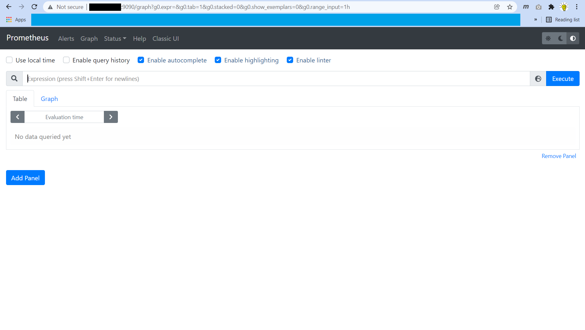

#### Instalasi Node Exporter

node exporter ini berfungsi untuk mengambil data penggunaan server, lalu prometheus akan secara periodic mengambil datanya.

1. download node exporter  
   `wget https://github.com/prometheus/node_exporter/releases/download/v1.3.0/node_exporter-1.3.0.linux-amd64.tar.gz`
2. extract node exporter  
   `tar xvf node_exporter-1.3.0.linux-amd64.tar.gz`
3. copy node exporter ke folder `/usr/loca/bin/`  
   `cp node_exporter-1.3.0.linux-amd64/node_exporter /usr/local/bin/`
4. buat user node_exporter  
   `useradd --no-create-home --shell /bin/false node_exporter`
5. berikan hak akses ke user node_exporter
   `chown node_exporter:node_exporter /usr/local/bin/node_exporter`
6. buat service node_exporter seperti saat membuat service prometheus  
   `touch /etc/systemd/system/node_exporter.service`  
   isi konfigurasinya

   ```bash
   [Unit]
   Description=Node Exporter
   Wants=network-online.target
   After=network-online.target

   [Service]
   User=node_exporter
   Group=node_exporter
   Type=simple
   ExecStart=/usr/local/bin/node_exporter

   [Install]
   WantedBy=multi-user.target
   ```

7. reload systemctl dan jalankan node_exporter
   ```bash
   systemctl daemon-reload
   systemctl start node_exporter
   systemctl status node_exporter
   systemctl enable node_exporter
   ```
8. buka `http://ip_domain_node_exporter:9100/metrics` untuk melihat hasil instalasi
   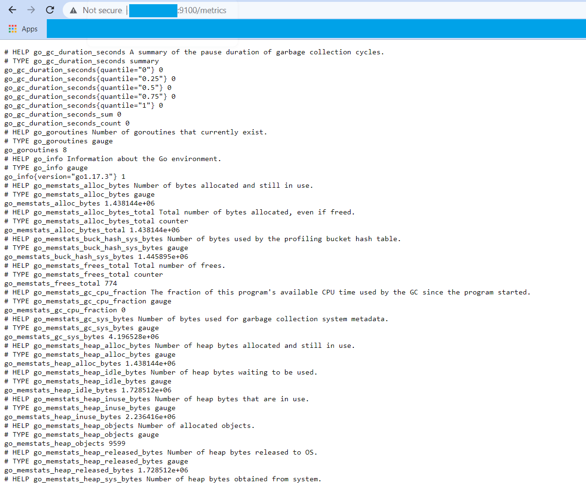
9. konfigurasi prometheus agar melakukan scrapping data.  
   tambahkan konfigurasi berikut pada file `/etc/prometheus/prometheus.yml`

   ```yaml
   ...
   scape_configs:
      - job_name: 'node' # nama job pengambilan data
         scrape_interval: 5s # interval pengambilan data 5 detik
         static_configs:
            - targets: ['localhost:9100'] # server mana saja yang akan diambil datanya, bisa lebih dari satu
   ```

   lalu restart prometheus `systemctl restart prometheus`

#### Instalasi Grafana

grafana digunakan untuk dashboard data yang ada pada prometheus. untuk melihat data pada grafana kita harus membuat sendiri dashboard yang kita inginkan. jika kita ingin menggunakan dashboard yang sudah jadi kita bisa mengimport dashboard yang sudah ada pada https://grafana.com/grafana/dashboards/ agar bisa kita gunakan.

install grafana:

1. tambahkan repository grafana  
   `touch /etc/yum.repos.d/grafana.repo`  
    isi filenya adalah
   ```bash
   [grafana]
   name=grafana
   baseurl=https://packages.grafana.com/oss/rpm
   repo_gpgcheck=1
   enabled=1
   gpgcheck=1
   gpgkey=https://packages.grafana.com/gpg.key
   sslverify=1
   sslcacert=/etc/pki/tls/certs/ca-bundle.crt
   ```
2. install grafana  
   `yum install grafana fontconfig freetype* urw-fonts`
3. jalankan grafana
   ```bash
   systemctl start grafana-server
   systemctl status grafana-server
   systemctl enable grafana-server
   ```
4. buka `http://ip_domain_grafana:3000/` pada browser  
   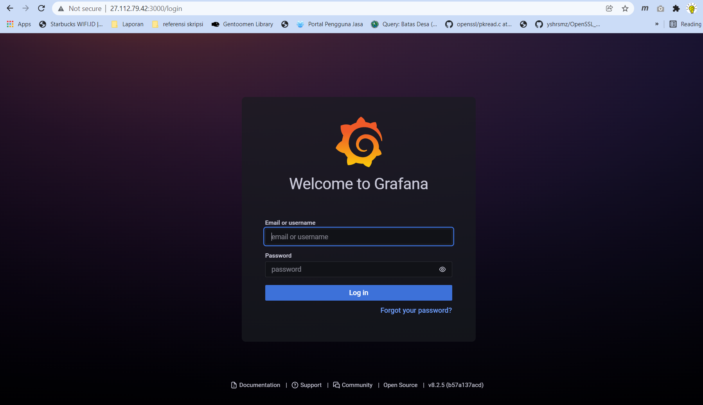
   username dan password untuk pertama login adalah
   ```
   username: admin
   password: admin
   ```
   setelah login kita akan diminta untuk mengganti password
5. halaman utama grafana
   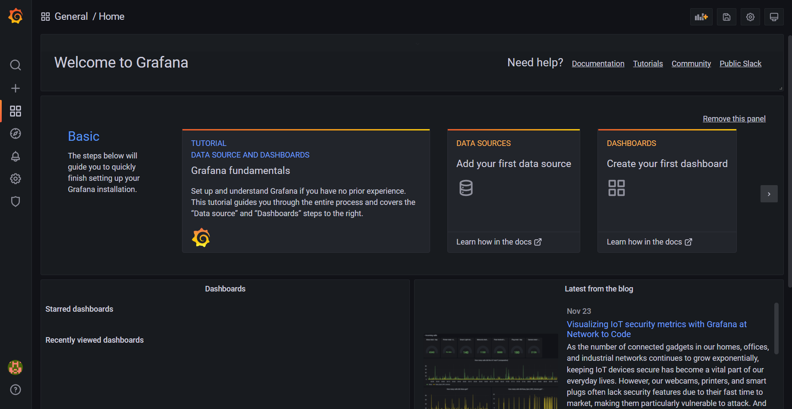
6. klik `Add your first data source` untuk menambahkan prometheus sebagai `data source`
   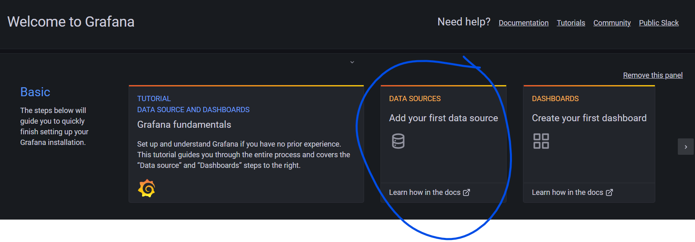
7. pilih `prometheus`
   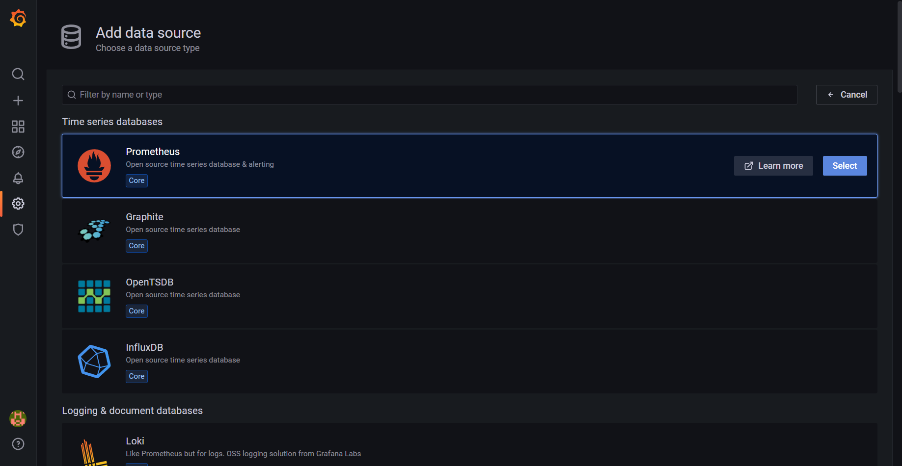
8. konfigurasi server prometheus. disini karena server prometheus dan grafana satu host maka kita akan menggunakan `localhost:9090` sebagai url servernya. lalu klik `save & test`
   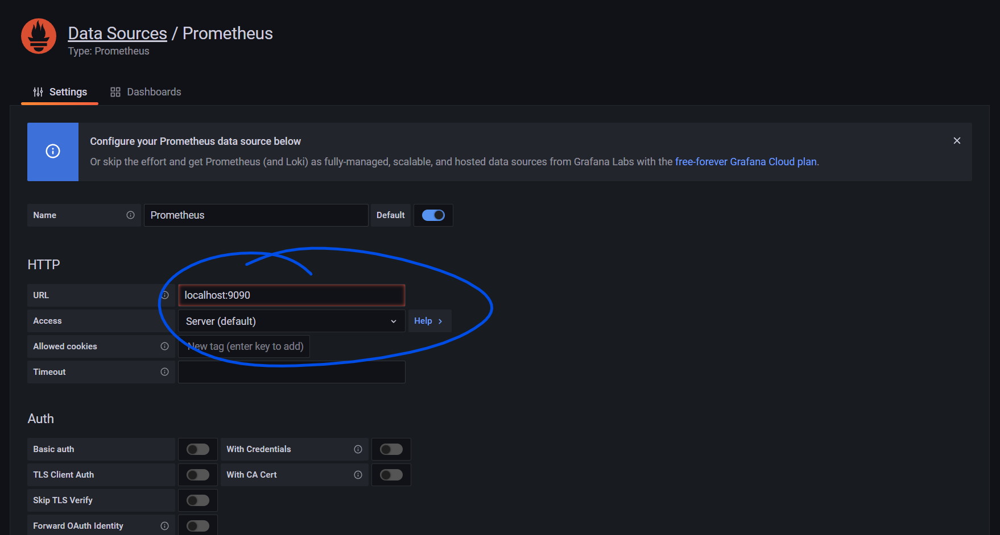
9. setelah sukses menambah `data source` kita akan mengimport dashboard
   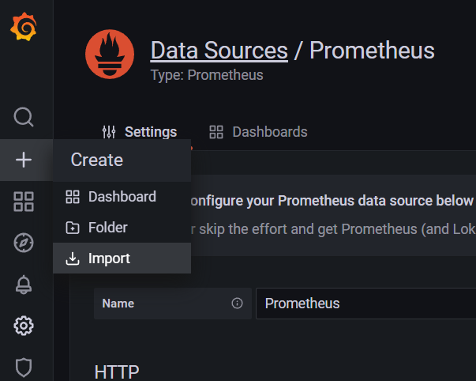
10. disini kita akan menggunakan dashboard `Node Exporter Quickstart and Dashboard` yang bisa dilihat pada https://grafana.com/grafana/dashboards/13978?pg=dashboards&plcmt=featured-dashboard-2
    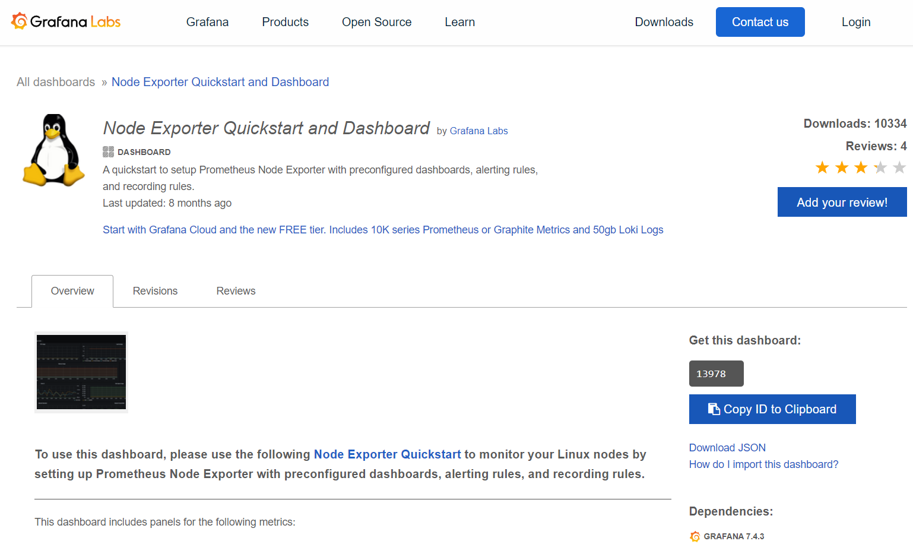
    masukan id dashboard lalu klik load
    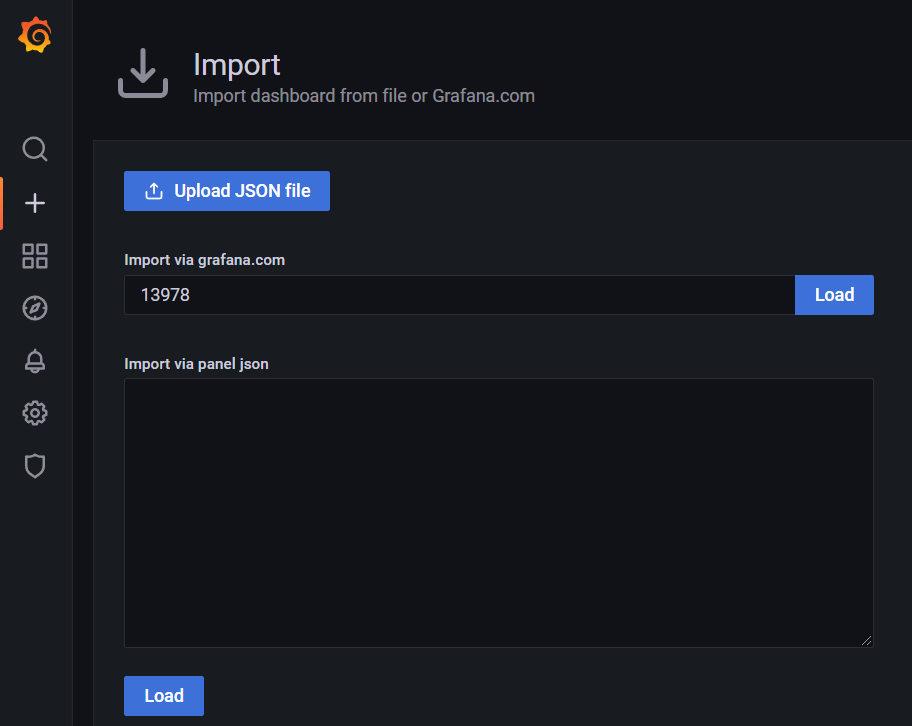
    lalu klik import
    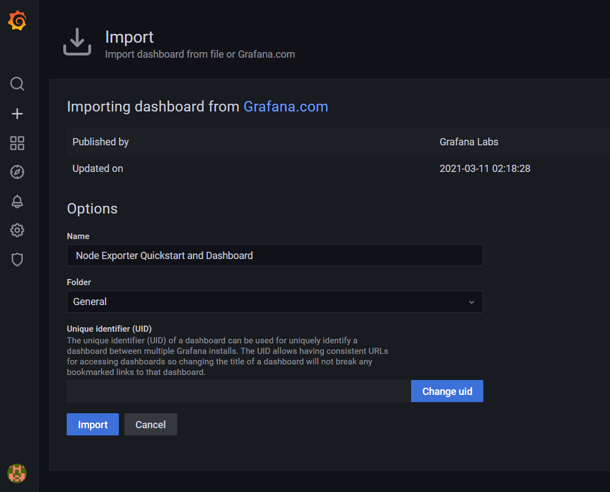
11. dashboard grafana
    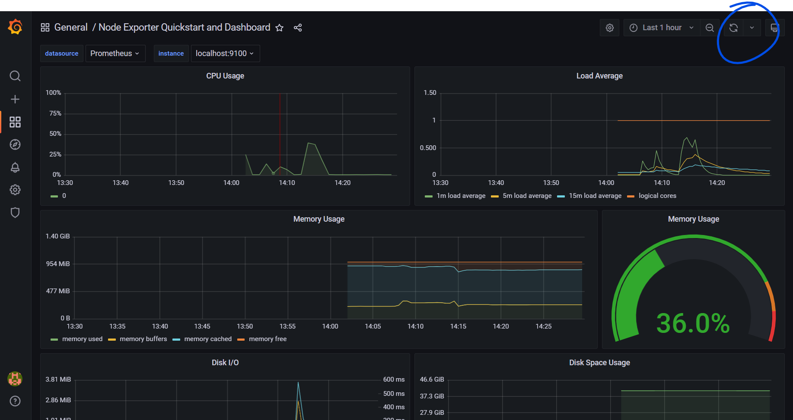
    agar dashboard melakukan update data bisa mengubah refresh interval pada icon `refresh`

selesai horeeeee.

### Kesimpulan

grafana dan prometheus adalah tools yang sangan powerfull untuk monitoring server dengan banyaknya pilihan dashboad dan exporter. tidak hanya untuk memonitor penggunaan server kita juga bisa memonitor database, webserver dan aplikasi-aplikasi lainnya

#### Referensi

- https://prometheus.io/
- https://prometheus.io/docs/guides/node-exporter/
- https://medium.com/pujanggateknologi/bereksperimen-dengan-prometheus-dan-grafana-untuk-memantau-berbagai-layanan-ea5d3d5cf095
- https://www.digitalocean.com/community/tutorials/how-to-install-prometheus-on-ubuntu-16-04
- https://www.fosslinux.com/8328/how-to-install-and-configure-grafana-on-centos-7.htm
